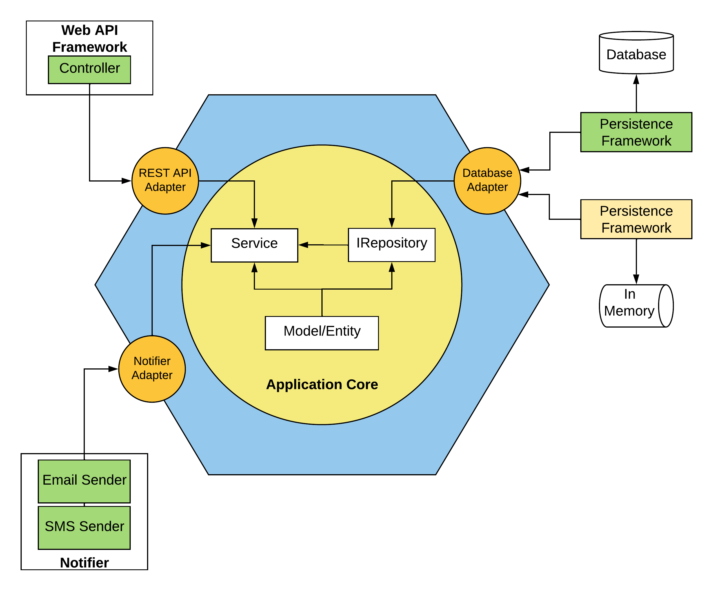

# Trabalho de Conclusão de Curso

## Título: Proposta de Modelo de Arquitetura Hexagonal Para Microservices Python

## Descrição

Este é o código-fonte do projeto de Estudo de Caso de meu TCC realizado em 2022. Possui o objetivo de demonstrar e testar de forma prática a aplicação do Modelo proposto na monografia. Segue um desenho do modelo.



### Resumo dos Conceitos do Modelo

- O modelo possui três partes principais: a parte interna, a fronteira ( ou *boundary* ) a parte externa.

  - **Parte Interna**, círculo amarelo, é a localização do Domínio da aplicação, seguindo conceitos do *Domain-Driven Design*, que independem de framework e outras tecnologias externas.

  - **Fronteira (Boundary)**, hexágono azul, se trata da localização dos *Adapters* do projeto para comunicação entre parte interna e parte externa para certas tecnologias como *Databases*, Notificações, etc. Baseado na Arquitetura Hexagonal de *Alistair Cockburn*, [link da teoria](https://alistair.cockburn.us/hexagonal-architecture/).

  - **Parte Externa**, parte fora do Hexágono Azul, possui as implantações das tecnologias utilizadas no projeto que acessem pacotes dentro da Parte Interna.

- Os *Adapters* possuem o propósito de fazer a ligação entre as partes externa e interna. Eles podem mudar dependendo da necessidade do projeto em queo modelo será utilizado.

### Estrutura de Pacotes do Projeto

```
|-> src
    |-> adapters ---> pacote com as classes Adapters do projeto
    |-> applicationCore ---> pacote do Domínio e Serviços da aplicação
        |-> domain ---> Entidades, Object Values e interfaces de Repositorios
        |-> services ---> Casos de uso de acordo com cada contexto 
    |-> infrastructure ---> pacote com as implementações da parte de infraestrutura do projeto 
```

### Tecnologias Utilizadas

- **Docker**: Plataforma com diversos serviços para virtualizar software a nível de sistema operacional no que é chamado de Contêiner. No projeto é voltado para criação e execução da API e dos Bancos de Dados (MySQL e MongoDB) em contêiners separados. [Documentação Docker](https://docs.docker.com/)

- **Flask Framework**: Micro-Framework Python, voltado para criação de pequenas aplicações web de forma rápida e moderna. [Documentação Flask](https://flask.palletsprojects.com/)

- **SQLAlchemy**: Framework ORM (Object Relational Mapper) para facilitar a conversão entre Classes e Tabelas em Base de Dados SQL. [Documentação SQLAlchemy](https://docs.sqlalchemy.org/en/14/)

## Como executar o projeto

Segue o passo a passo para execução e levantamento do projeto inteiro (API + Bancos de Dados):

1. instalar as últimas versões do [Docker CE](https://docs.docker.com/get-docker/) e [Docker-Compose](https://docs.docker.com/compose/install/) na máquina onde irá ocorrer a execução do projeto.

2. abrir o terminal (linha de comando) da máquina e executar seguinte comando:

    ```cmd
    docker-compose up -d
    ```

3. no seu browser favorito vá no endereço: <http://localhost:5000>

4. no endereço está uma documentação com os endpoints da API do projeto com os dados de entrada necessários para cada endpoint.
